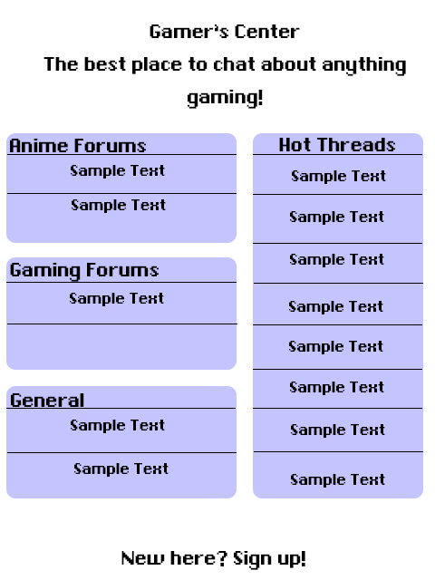
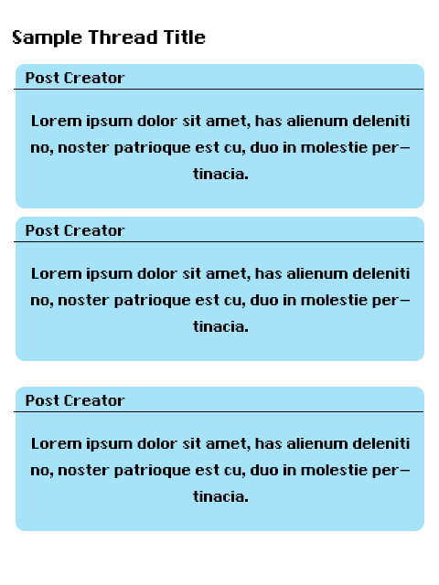
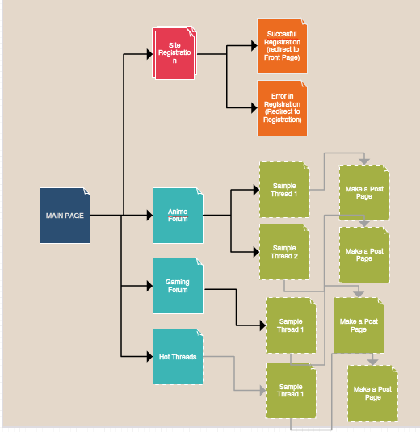
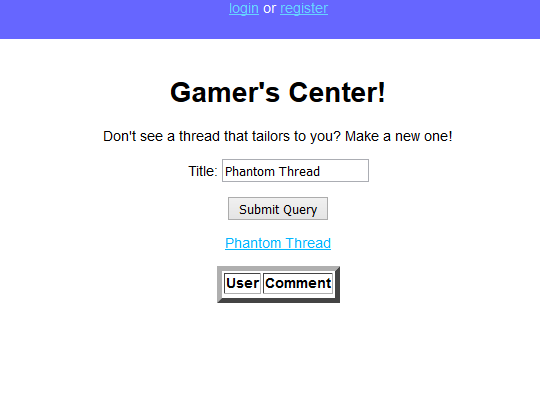
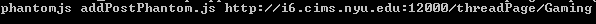
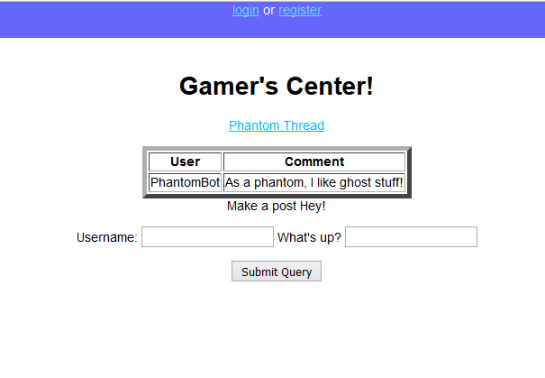
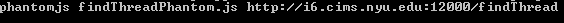
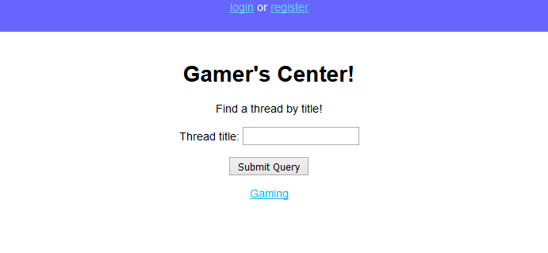

# Gamer's Center

## Overview

There are many people out there that enjoy forms of entertainment such as video games and Japanese Anime/Manga, but don't really have a lot of people that have the same interests surrounding them.

The goal of Gamer's Center is to give these people a platform to communicate with each other and share their own thoughts and opinions about such forms of entertainment via online forums. Users create an account that describes themselves and they can make posts on threads to share their own opinions and thoughts about various subjects.


## Data Model

We will be storing Users, forums, threads, and posts:
* Users will have just a username and password
* Forums will have multiple threads
* Threads will have multiple posts
* Posts will have simply text and the username posting it.

First draft schema:

```javascript
var User = new mongoose.Schema({
	//username and password provided by plugin

});

var Forum = new mongoose.Schema({
	listOfThreads: [{type: Thread}]

});

var Thread = new mongoose.Schema({
	listOfPosts: [{type: Post}]

});

var Post = new mongoose.Schema({
	poster: {type: mongoose.Schema.Types.ObjectId, ref:'User'},
	content: {type: String, required: true}
});
```

## Wireframes





## Site FlowChart




## User Stories

* As a user, I want to communicate with other people via Gamer's Center through threads to share my thoughts and opinions on games and anime
* In order to create a fun experience for everyone participating in the site, I want to create threads full of discussion that is neatly filed in its appropriate category for easy access
* As a user, I can create an account, and immediately start posting on various threads


## Additionals

* User authentication
    * Passport for user authentication
    * User authentication here is important because we'd like each user to have their own unique account to know them by.
* PhantomJS for testing of the site
    * PhantomJS used to test the creation of forums/threads/and post


## Milestone 2

* The urls where the form reading in a post is simply in http://localhost:3000
* For displaying the posts within the database, http://localhost:3000 is also used
* PhantomJs was partially implemented here, testing out automated posting, and its result also goes into http://localhost:3000
* The result of PhantomJS is automatically adding a post to the database (In this case the post would be with username "Masrour" and text "This is a test with PhantomJS!"
* The code for it can be found in project/phantomtest.js
* To run phantomtest.js, while withint the phantomJS terminal, run with the following two parameters: "localhost:3000 phantomtest.js"
* This will automate a post onto the site.

## Milestone 3
* Directory project2 cotains the required documents for milestone 3

## Final Report
* PhantomJS: We implemented PhantomJS to do headless browser testing of our links.
* 1. Testing adding a thread:
* Input in PhantomJS directory:
* 
* Result:
* 
* 2. Adding a post to a thread:
* 
* Result: 
* 
* 3. Finding a thread:
* 
* Result:
* 
* Also, we implemented user authentication.
